# Alibre Design on Github

  - Methodology: Data is collected via GitHub REST API repository search and releases endpoints using fixed search terms and deterministic grouping rules.
  - Scope: Results reflect publicly accessible GitHub data at the snapshot time; private repos and inaccessible resources are excluded.
  - Search Constraints: Repository discovery uses term matching against repository metadata and is subject to GitHub search indexing behavior and API limits.
  - Language Filter: Analysis includes only repositories whose primary language is C#, Python, IronPython, HTML, Visual Basic (.NET/VB variants), or C++ (including close variants).
  - Release Coverage: Release summaries include only repositories with at least one GitHub Release; repositories without releases are excluded from release-only tables.
  - Attribution: Download counts are sourced from GitHub release asset download metrics and may change over time.
  - Quality Note: Term matches indicate probable relevance, not guaranteed topical correctness; flagged repositories may be false positives.
  - Snapshot Disclaimer: Metrics are point-in-time and reproducible only for the same query terms, filters, and API state at collection time.
  - Non-Endorsement: Inclusion in this report does not imply endorsement, affiliation, or validation by Alibre LLC or repository owners.
  - Use Limitation: This report is for research/operational insight and should not be used as sole evidence for legal, licensing, or compliance decisions.

# By Project

## All Repos Matched (Full Detail)

| Project | Owner | Language | Stars | Forks | Matched Terms | Relevance Note |
| --- | --- | --- | --- | --- | --- | --- |
| [bolsover/UtilitiesForAlibre](https://github.com/bolsover/UtilitiesForAlibre) | bolsover | C# | 8 | 3 | alibre |  |
| [the-tool-store/alibre-stltostp-addon](https://github.com/the-tool-store/alibre-stltostp-addon) | the-tool-store | C# | 3 | 0 | "alibre design" \| alibre |  |
| [bolsover/AlibreBOM](https://github.com/bolsover/AlibreBOM) | bolsover | C# | 2 | 0 | alibre |  |
| [bolsover/AlibreExportOpen](https://github.com/bolsover/AlibreExportOpen) | bolsover | C# | 2 | 0 | alibre |  |
| [bolsover/AlibreShortcuts](https://github.com/bolsover/AlibreShortcuts) | bolsover | C# | 2 | 1 | alibre |  |
| [bolsover/DataBrowserForAlibre](https://github.com/bolsover/DataBrowserForAlibre) | bolsover | C# | 2 | 0 | alibre |  |
| [k4kfh/alibre-neutralizer](https://github.com/k4kfh/alibre-neutralizer) | k4kfh | Python | 2 | 1 | "alibre design" \| alibre |  |
| [stephensmitchell/AlibreScript](https://github.com/stephensmitchell/AlibreScript) | stephensmitchell | Python | 2 | 0 | "alibre script" \| alibre \| alibrescript |  |
| [Karl690/AlibrePartInjector](https://github.com/Karl690/AlibrePartInjector) | Karl690 | C# | 1 | 0 | alibre |  |
| [stephensmitchell/alibre-logos](https://github.com/stephensmitchell/alibre-logos) | stephensmitchell | HTML | 1 | 0 | alibre |  |
| [stephensmitchell/alibre-programming](https://github.com/stephensmitchell/alibre-programming) | stephensmitchell | Python | 1 | 0 | "alibre script" \| alibre \| alibrex |  |
| [stephensmitchell/alibre-script-adk](https://github.com/stephensmitchell/alibre-script-adk) | stephensmitchell | Python | 1 | 0 | "alibre script" \| alibre |  |
| [stephensmitchell/alibre-script-examples](https://github.com/stephensmitchell/alibre-script-examples) | stephensmitchell | Python | 1 | 0 | alibre |  |
| [stephensmitchell/alibre-script-library-examples](https://github.com/stephensmitchell/alibre-script-library-examples) | stephensmitchell | Python | 1 | 0 | alibre |  |
| [stephensmitchell/AlibreScript-playground](https://github.com/stephensmitchell/AlibreScript-playground) | stephensmitchell | HTML | 1 | 1 | alibre \| alibrescript |  |
| [stephensmitchell/AlibreScript-vscode](https://github.com/stephensmitchell/AlibreScript-vscode) | stephensmitchell | Python | 1 | 0 | alibre \| alibrescript |  |
| [stephensmitchell/GetInstalledAddons.Tool](https://github.com/stephensmitchell/GetInstalledAddons.Tool) | stephensmitchell | Visual Basic .NET | 1 | 0 | "alibre design" \| alibre |  |
| [the-tool-store/alibre-assembly-constraints-pp-addon](https://github.com/the-tool-store/alibre-assembly-constraints-pp-addon) | the-tool-store | Python | 1 | 0 | alibre |  |
| [the-tool-store/alibre-assimp-addon](https://github.com/the-tool-store/alibre-assimp-addon) | the-tool-store | C# | 1 | 0 | "alibre design" \| alibre |  |
| [the-tool-store/alibre-cpp-addon-template-2](https://github.com/the-tool-store/alibre-cpp-addon-template-2) | the-tool-store | C++ | 1 | 0 | alibre |  |
| [the-tool-store/alibre-cross-section-tools-addon](https://github.com/the-tool-store/alibre-cross-section-tools-addon) | the-tool-store | Python | 1 | 1 | alibre |  |
| [the-tool-store/alibre-design-explorer-refresh-tool](https://github.com/the-tool-store/alibre-design-explorer-refresh-tool) | the-tool-store | Visual Basic .NET | 1 | 0 | "alibre design" \| alibre |  |
| [the-tool-store/alibre-fillet-r-and-d-app](https://github.com/the-tool-store/alibre-fillet-r-and-d-app) | the-tool-store | Visual Basic .NET | 1 | 0 | alibre |  |
| [the-tool-store/alibre-HOOPS-addon](https://github.com/the-tool-store/alibre-HOOPS-addon) | the-tool-store | C# | 1 | 0 | alibre |  |
| [the-tool-store/alibre-preset-system-demo](https://github.com/the-tool-store/alibre-preset-system-demo) | the-tool-store | Visual Basic .NET | 1 | 0 | alibre |  |
| [the-tool-store/alibre-py-gear-addon](https://github.com/the-tool-store/alibre-py-gear-addon) | the-tool-store | Python | 1 | 0 | "alibre design" \| alibre |  |
| [the-tool-store/alibre-python-shell-addon](https://github.com/the-tool-store/alibre-python-shell-addon) | the-tool-store | C# | 1 | 0 | "alibre design" \| alibre |  |
| [the-tool-store/alibre-python-shell-addon-v2](https://github.com/the-tool-store/alibre-python-shell-addon-v2) | the-tool-store | C# | 1 | 1 | "alibre design" \| alibre |  |
| [the-tool-store/alibre-script-runner](https://github.com/the-tool-store/alibre-script-runner) | the-tool-store | Python | 1 | 0 | "alibre script" \| alibre |  |
| [the-tool-store/alibre-scripting-addon](https://github.com/the-tool-store/alibre-scripting-addon) | the-tool-store | Visual Basic .NET | 1 | 1 | "alibre script" \| alibre |  |
| [the-tool-store/alibre-shapes-addon](https://github.com/the-tool-store/alibre-shapes-addon) | the-tool-store | C# | 1 | 0 | "alibre script" \| alibre |  |
| [the-tool-store/alibre-sweep-tools-addon](https://github.com/the-tool-store/alibre-sweep-tools-addon) | the-tool-store | Python | 1 | 1 | alibre |  |
| [the-tool-store/alibre-testbed-addon](https://github.com/the-tool-store/alibre-testbed-addon) | the-tool-store | Visual Basic .NET | 1 | 0 | "alibre design" \| alibre |  |
| [the-tool-store/alibre-vscodium-addon](https://github.com/the-tool-store/alibre-vscodium-addon) | the-tool-store | Python | 1 | 0 | alibre |  |
| [bolsover/AlibreImportStlAsStep](https://github.com/bolsover/AlibreImportStlAsStep) | bolsover | C# | 0 | 0 | alibre |  |
| [EdGames05/ALibrerias](https://github.com/EdGames05/ALibrerias) | EdGames05 | C++ | 0 | 0 | alibre |  |
| [ftkalcevic/AlibreGears](https://github.com/ftkalcevic/AlibreGears) | ftkalcevic | C# | 0 | 0 | alibre |  |
| [LemonExplosive/AlibreCadScripts](https://github.com/LemonExplosive/AlibreCadScripts) | LemonExplosive | Python | 0 | 0 | alibre |  |
| [michaelplas/Alibrero](https://github.com/michaelplas/Alibrero) | michaelplas | Python | 0 | 0 | alibre |  |
| [mukut1994/CheckAlibreXPortableBinDirIsWorking](https://github.com/mukut1994/CheckAlibreXPortableBinDirIsWorking) | mukut1994 | C# | 0 | 0 | alibre \| alibrex |  |
| [the-tool-store/AlibreScriptExamples-package](https://github.com/the-tool-store/AlibreScriptExamples-package) | the-tool-store | Python | 0 | 0 | alibre \| alibrescript |  |

## Projects

| Project | Owner | Language | Stars | Forks | Matched Terms | Releases | Total Release Downloads | Latest Release | Relevance Note |
| --- | --- | --- | --- | --- | --- | --- | --- | --- | --- |
| [bolsover/UtilitiesForAlibre](https://github.com/bolsover/UtilitiesForAlibre) | bolsover | C# | 8 | 3 | alibre | 17 | 1223 | 2025-09-24T13:32:15Z |  |
| [bolsover/AlibreShortcuts](https://github.com/bolsover/AlibreShortcuts) | bolsover | C# | 2 | 1 | alibre | 10 | 147 | 2023-11-23T14:24:56Z |  |
| [bolsover/AlibreExportOpen](https://github.com/bolsover/AlibreExportOpen) | bolsover | C# | 2 | 0 | alibre | 2 | 113 | 2022-11-08T15:01:00Z |  |
| [the-tool-store/alibre-sweep-tools-addon](https://github.com/the-tool-store/alibre-sweep-tools-addon) | the-tool-store | Python | 1 | 1 | alibre | 2 | 70 | 2025-09-01T13:34:58Z |  |
| [the-tool-store/alibre-python-shell-addon](https://github.com/the-tool-store/alibre-python-shell-addon) | the-tool-store | C# | 1 | 0 | "alibre design" \| alibre | 1 | 62 | 2024-03-19T21:23:47Z |  |
| [bolsover/AlibreImportStlAsStep](https://github.com/bolsover/AlibreImportStlAsStep) | bolsover | C# | 0 | 0 | alibre | 4 | 53 | 2025-11-06T14:37:53Z |  |
| [the-tool-store/alibre-shapes-addon](https://github.com/the-tool-store/alibre-shapes-addon) | the-tool-store | C# | 1 | 0 | "alibre script" \| alibre | 3 | 25 | 2025-07-23T20:10:40Z |  |
| [stephensmitchell/AlibreScript-vscode](https://github.com/stephensmitchell/AlibreScript-vscode) | stephensmitchell | Python | 1 | 0 | alibre \| alibrescript | 1 | 5 | 2025-10-22T20:03:06Z |  |
| [the-tool-store/alibre-cross-section-tools-addon](https://github.com/the-tool-store/alibre-cross-section-tools-addon) | the-tool-store | Python | 1 | 1 | alibre | 2 | 5 | 2026-02-14T01:08:04Z |  |
| [the-tool-store/alibre-stltostp-addon](https://github.com/the-tool-store/alibre-stltostp-addon) | the-tool-store | C# | 3 | 0 | "alibre design" \| alibre | 0 | 0 |  |  |
| [bolsover/AlibreBOM](https://github.com/bolsover/AlibreBOM) | bolsover | C# | 2 | 0 | alibre | 0 | 0 |  |  |
| [bolsover/DataBrowserForAlibre](https://github.com/bolsover/DataBrowserForAlibre) | bolsover | C# | 2 | 0 | alibre | 0 | 0 |  |  |
| [k4kfh/alibre-neutralizer](https://github.com/k4kfh/alibre-neutralizer) | k4kfh | Python | 2 | 1 | "alibre design" \| alibre | 0 | 0 |  |  |
| [stephensmitchell/AlibreScript](https://github.com/stephensmitchell/AlibreScript) | stephensmitchell | Python | 2 | 0 | "alibre script" \| alibre \| alibrescript | 0 | 0 |  |  |
| [Karl690/AlibrePartInjector](https://github.com/Karl690/AlibrePartInjector) | Karl690 | C# | 1 | 0 | alibre | 0 | 0 |  |  |
| [stephensmitchell/alibre-logos](https://github.com/stephensmitchell/alibre-logos) | stephensmitchell | HTML | 1 | 0 | alibre | 0 | 0 |  |  |
| [stephensmitchell/alibre-programming](https://github.com/stephensmitchell/alibre-programming) | stephensmitchell | Python | 1 | 0 | "alibre script" \| alibre \| alibrex | 0 | 0 |  |  |
| [stephensmitchell/alibre-script-adk](https://github.com/stephensmitchell/alibre-script-adk) | stephensmitchell | Python | 1 | 0 | "alibre script" \| alibre | 0 | 0 |  |  |
| [stephensmitchell/alibre-script-examples](https://github.com/stephensmitchell/alibre-script-examples) | stephensmitchell | Python | 1 | 0 | alibre | 0 | 0 |  |  |
| [stephensmitchell/alibre-script-library-examples](https://github.com/stephensmitchell/alibre-script-library-examples) | stephensmitchell | Python | 1 | 0 | alibre | 0 | 0 |  |  |
| [stephensmitchell/AlibreScript-playground](https://github.com/stephensmitchell/AlibreScript-playground) | stephensmitchell | HTML | 1 | 1 | alibre \| alibrescript | 0 | 0 |  |  |
| [stephensmitchell/GetInstalledAddons.Tool](https://github.com/stephensmitchell/GetInstalledAddons.Tool) | stephensmitchell | Visual Basic .NET | 1 | 0 | "alibre design" \| alibre | 0 | 0 |  |  |
| [the-tool-store/alibre-assembly-constraints-pp-addon](https://github.com/the-tool-store/alibre-assembly-constraints-pp-addon) | the-tool-store | Python | 1 | 0 | alibre | 0 | 0 |  |  |
| [the-tool-store/alibre-assimp-addon](https://github.com/the-tool-store/alibre-assimp-addon) | the-tool-store | C# | 1 | 0 | "alibre design" \| alibre | 0 | 0 |  |  |
| [the-tool-store/alibre-cpp-addon-template-2](https://github.com/the-tool-store/alibre-cpp-addon-template-2) | the-tool-store | C++ | 1 | 0 | alibre | 0 | 0 |  |  |
| [the-tool-store/alibre-design-explorer-refresh-tool](https://github.com/the-tool-store/alibre-design-explorer-refresh-tool) | the-tool-store | Visual Basic .NET | 1 | 0 | "alibre design" \| alibre | 0 | 0 |  |  |
| [the-tool-store/alibre-fillet-r-and-d-app](https://github.com/the-tool-store/alibre-fillet-r-and-d-app) | the-tool-store | Visual Basic .NET | 1 | 0 | alibre | 0 | 0 |  |  |
| [the-tool-store/alibre-HOOPS-addon](https://github.com/the-tool-store/alibre-HOOPS-addon) | the-tool-store | C# | 1 | 0 | alibre | 0 | 0 |  |  |
| [the-tool-store/alibre-preset-system-demo](https://github.com/the-tool-store/alibre-preset-system-demo) | the-tool-store | Visual Basic .NET | 1 | 0 | alibre | 0 | 0 |  |  |
| [the-tool-store/alibre-py-gear-addon](https://github.com/the-tool-store/alibre-py-gear-addon) | the-tool-store | Python | 1 | 0 | "alibre design" \| alibre | 0 | 0 |  |  |
| [the-tool-store/alibre-python-shell-addon-v2](https://github.com/the-tool-store/alibre-python-shell-addon-v2) | the-tool-store | C# | 1 | 1 | "alibre design" \| alibre | 0 | 0 |  |  |
| [the-tool-store/alibre-script-runner](https://github.com/the-tool-store/alibre-script-runner) | the-tool-store | Python | 1 | 0 | "alibre script" \| alibre | 0 | 0 |  |  |
| [the-tool-store/alibre-scripting-addon](https://github.com/the-tool-store/alibre-scripting-addon) | the-tool-store | Visual Basic .NET | 1 | 1 | "alibre script" \| alibre | 0 | 0 |  |  |
| [the-tool-store/alibre-testbed-addon](https://github.com/the-tool-store/alibre-testbed-addon) | the-tool-store | Visual Basic .NET | 1 | 0 | "alibre design" \| alibre | 0 | 0 |  |  |
| [the-tool-store/alibre-vscodium-addon](https://github.com/the-tool-store/alibre-vscodium-addon) | the-tool-store | Python | 1 | 0 | alibre | 0 | 0 |  |  |
| [EdGames05/ALibrerias](https://github.com/EdGames05/ALibrerias) | EdGames05 | C++ | 0 | 0 | alibre | 0 | 0 |  |  |
| [ftkalcevic/AlibreGears](https://github.com/ftkalcevic/AlibreGears) | ftkalcevic | C# | 0 | 0 | alibre | 0 | 0 |  |  |
| [LemonExplosive/AlibreCadScripts](https://github.com/LemonExplosive/AlibreCadScripts) | LemonExplosive | Python | 0 | 0 | alibre | 0 | 0 |  |  |
| [michaelplas/Alibrero](https://github.com/michaelplas/Alibrero) | michaelplas | Python | 0 | 0 | alibre | 0 | 0 |  |  |
| [mukut1994/CheckAlibreXPortableBinDirIsWorking](https://github.com/mukut1994/CheckAlibreXPortableBinDirIsWorking) | mukut1994 | C# | 0 | 0 | alibre \| alibrex | 0 | 0 |  |  |
| [the-tool-store/AlibreScriptExamples-package](https://github.com/the-tool-store/AlibreScriptExamples-package) | the-tool-store | Python | 0 | 0 | alibre \| alibrescript | 0 | 0 |  |  |

## By User/Org

| Owner | Projects | Stars | Releases | Total Release Downloads |
| --- | --- | --- | --- | --- |
| bolsover | 6 | 16 | 33 | 1536 |
| the-tool-store | 19 | 20 | 8 | 162 |
| stephensmitchell | 9 | 10 | 1 | 5 |
| k4kfh | 1 | 2 | 0 | 0 |
| Karl690 | 1 | 1 | 0 | 0 |
| EdGames05 | 1 | 0 | 0 | 0 |
| ftkalcevic | 1 | 0 | 0 | 0 |
| LemonExplosive | 1 | 0 | 0 | 0 |
| michaelplas | 1 | 0 | 0 | 0 |
| mukut1994 | 1 | 0 | 0 | 0 |

### Chart: By Project: Downloads by User/Org

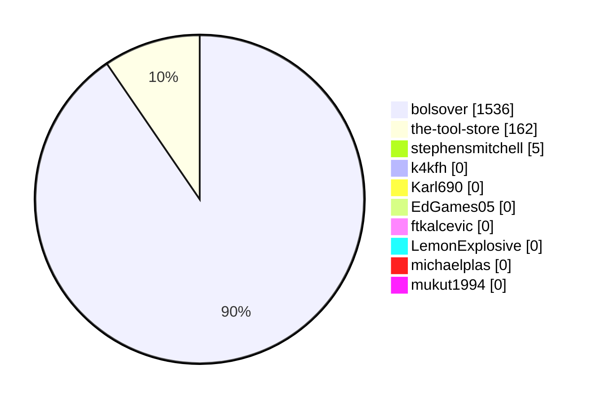

## By Language

| Language | Projects | Stars | Releases | Total Release Downloads |
| --- | --- | --- | --- | --- |
| C# | 15 | 25 | 37 | 1623 |
| Python | 16 | 15 | 5 | 80 |
| Visual Basic .NET | 6 | 6 | 0 | 0 |
| HTML | 2 | 2 | 0 | 0 |
| C++ | 2 | 1 | 0 | 0 |

### Chart: By Project: Downloads by Language

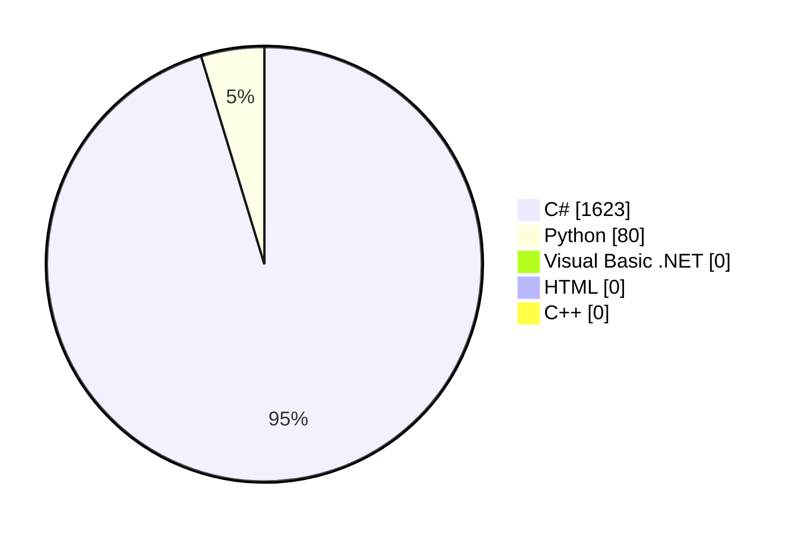

## By Search Term

| Search Term | Quick Total (No Slice) | Matched By Name/Desc | New Unique Projects | Newly Tagged Existing Projects |
| --- | --- | --- | --- | --- |
| alibre | 67 | 66 | 66 | 0 |
| "alibre design" | 16 | 15 | 0 | 15 |
| "alibre script" | 14 | 7 | 0 | 7 |
| alibrescript | 6 | 6 | 0 | 6 |
| alibrex | 4 | 4 | 0 | 4 |
| "alibrex api" | 1 | 1 | 0 | 1 |
| "alibre api" | 0 | 0 | 0 | 0 |

### Chart: By Project: Matched Projects by Search Term

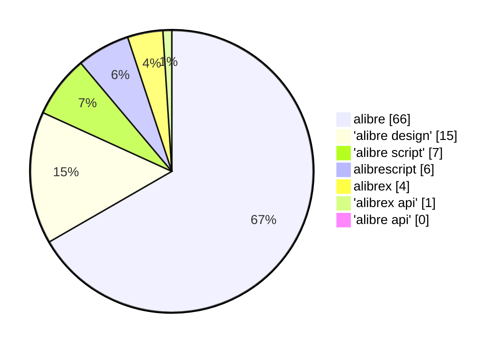

| Search Term | Projects | Stars | Releases | Total Release Downloads |
| --- | --- | --- | --- | --- |
| alibre | 41 | 49 | 42 | 1703 |
| "alibre design" | 9 | 12 | 1 | 62 |
| "alibre script" | 6 | 7 | 3 | 25 |
| alibrescript | 4 | 4 | 1 | 5 |
| alibrex | 2 | 1 | 0 | 0 |
| "alibre api" | 0 | 0 | 0 | 0 |
| "alibrex api" | 0 | 0 | 0 | 0 |

### Chart: By Project: Downloads by Search Term

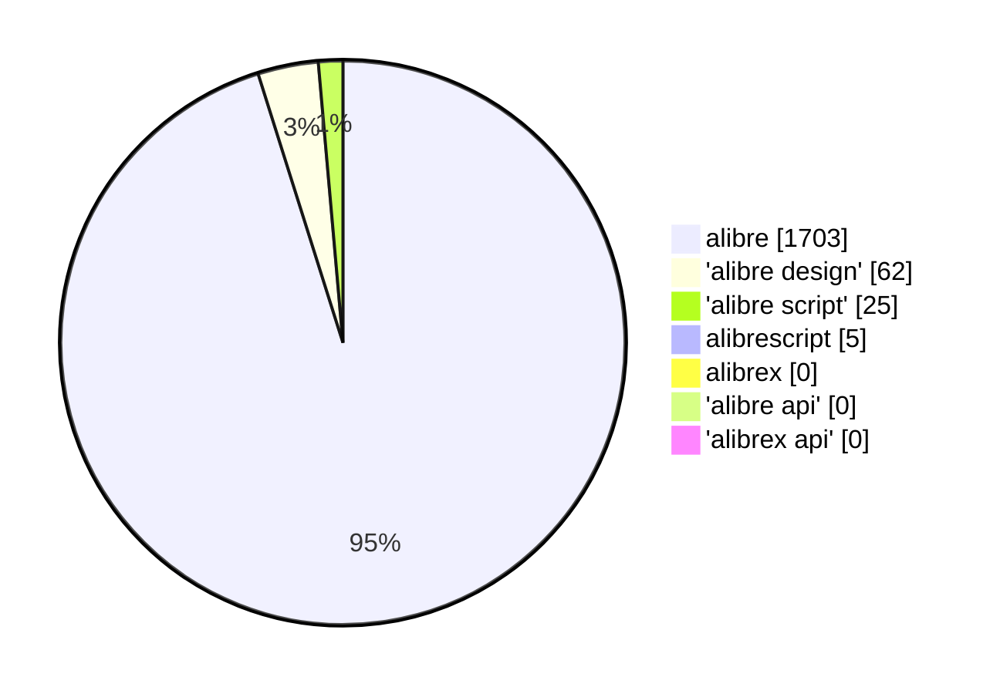

# By Project -> Release

## All Releases Matched (Full Detail)

| Project | Owner | Language | Tag | Release | Published | Draft | Prerelease | Assets | Downloads | Top Asset | Top Asset Downloads | Matched Terms | Relevance Note |
| --- | --- | --- | --- | --- | --- | --- | --- | --- | --- | --- | --- | --- | --- |
| [bolsover/AlibreExportOpen](https://github.com/bolsover/AlibreExportOpen) | bolsover | C# | V1.1 | [Version 1.1 installer](https://github.com/bolsover/AlibreExportOpen/releases/tag/V1.1) | 2022-11-08T15:01:00Z | false | false | 1 | 85 | AlibreExportOpen-1.1.zip | 85 | alibre |  |
| [bolsover/AlibreExportOpen](https://github.com/bolsover/AlibreExportOpen) | bolsover | C# | V1.0 | [Version 1.0 with Installer](https://github.com/bolsover/AlibreExportOpen/releases/tag/V1.0) | 2022-11-01T21:16:30Z | false | false | 1 | 28 | AlibreExportOpen.exe | 28 | alibre |  |
| [bolsover/AlibreImportStlAsStep](https://github.com/bolsover/AlibreImportStlAsStep) | bolsover | C# | V1.3 | [Version 1.3](https://github.com/bolsover/AlibreImportStlAsStep/releases/tag/V1.3) | 2025-11-06T14:37:53Z | false | false | 3 | 37 | AlibreImportStlAsStep1_3.exe | 25 | alibre |  |
| [bolsover/AlibreImportStlAsStep](https://github.com/bolsover/AlibreImportStlAsStep) | bolsover | C# | V1.2 | [Version 1.2](https://github.com/bolsover/AlibreImportStlAsStep/releases/tag/V1.2) | 2025-11-05T14:13:12Z | false | false | 3 | 5 | AlibreImportStlAsStep1_2.exe | 2 | alibre |  |
| [bolsover/AlibreImportStlAsStep](https://github.com/bolsover/AlibreImportStlAsStep) | bolsover | C# | V1.1 | [V1.1](https://github.com/bolsover/AlibreImportStlAsStep/releases/tag/V1.1) | 2025-11-04T13:35:12Z | false | false | 3 | 5 | AlibreImportStlAsStep1_1.exe | 4 | alibre |  |
| [bolsover/AlibreImportStlAsStep](https://github.com/bolsover/AlibreImportStlAsStep) | bolsover | C# | V1.0 | [Initial Release](https://github.com/bolsover/AlibreImportStlAsStep/releases/tag/V1.0) | 2025-11-03T15:30:22Z | false | false | 3 | 6 | AlibreImportStlAsStep1_0.exe | 4 | alibre |  |
| [bolsover/AlibreShortcuts](https://github.com/bolsover/AlibreShortcuts) | bolsover | C# | V3.1 | [Release V3.1](https://github.com/bolsover/AlibreShortcuts/releases/tag/V3.1) | 2023-11-23T14:24:56Z | false | false | 1 | 63 | AlibreShortcutsSetup.3.1.zip | 63 | alibre |  |
| [bolsover/AlibreShortcuts](https://github.com/bolsover/AlibreShortcuts) | bolsover | C# | V3.0 | [Release 3.0](https://github.com/bolsover/AlibreShortcuts/releases/tag/V3.0) | 2023-11-17T13:46:13Z | false | false | 1 | 10 | AlibreShortcutsSetup.3.0.zip | 10 | alibre |  |
| [bolsover/AlibreShortcuts](https://github.com/bolsover/AlibreShortcuts) | bolsover | C# | V2.3 | [Release V2.3](https://github.com/bolsover/AlibreShortcuts/releases/tag/V2.3) | 2023-11-10T11:10:49Z | false | false | 1 | 13 | AlibreShortcutsSetup.2.3.zip | 13 | alibre |  |
| [bolsover/AlibreShortcuts](https://github.com/bolsover/AlibreShortcuts) | bolsover | C# | V2.2 | [Version 2.2](https://github.com/bolsover/AlibreShortcuts/releases/tag/V2.2) | 2023-11-09T20:10:39Z | false | false | 1 | 4 | AlibreShortcutsSetup.2.2.zip | 4 | alibre |  |
| [bolsover/AlibreShortcuts](https://github.com/bolsover/AlibreShortcuts) | bolsover | C# | V2.1 | [Release V2.1](https://github.com/bolsover/AlibreShortcuts/releases/tag/V2.1) | 2023-11-09T12:11:54Z | false | false | 1 | 7 | AlibreShortcutsSetup.2.1.zip | 7 | alibre |  |
| [bolsover/AlibreShortcuts](https://github.com/bolsover/AlibreShortcuts) | bolsover | C# | V2.0 | [Release V2.0](https://github.com/bolsover/AlibreShortcuts/releases/tag/V2.0) | 2023-11-08T11:47:44Z | false | false | 1 | 8 | AlibreShortcutsSetup2.0.zip | 8 | alibre |  |
| [bolsover/AlibreShortcuts](https://github.com/bolsover/AlibreShortcuts) | bolsover | C# | V1.3 | [Release V1.3](https://github.com/bolsover/AlibreShortcuts/releases/tag/V1.3) | 2023-10-30T12:52:14Z | false | false | 1 | 16 | AlibreShortcutsSetup1.3.zip | 16 | alibre |  |
| [bolsover/AlibreShortcuts](https://github.com/bolsover/AlibreShortcuts) | bolsover | C# | V1.2 | [Release V1.2](https://github.com/bolsover/AlibreShortcuts/releases/tag/V1.2) | 2023-10-27T20:27:31Z | false | false | 1 | 13 | AlibreShortcutsSetup1.2.zip | 13 | alibre |  |
| [bolsover/AlibreShortcuts](https://github.com/bolsover/AlibreShortcuts) | bolsover | C# | V1.1 | [Test Release V1.1](https://github.com/bolsover/AlibreShortcuts/releases/tag/V1.1) | 2023-10-26T19:15:48Z | false | true | 1 | 8 | AlibreShortcutsSetup1.1.zip | 8 | alibre |  |
| [bolsover/AlibreShortcuts](https://github.com/bolsover/AlibreShortcuts) | bolsover | C# | 1.0.0 | [Initial Test Release](https://github.com/bolsover/AlibreShortcuts/releases/tag/1.0.0) | 2023-10-25T20:54:17Z | false | true | 1 | 5 | AlibreShortcutsSetup.exe | 5 | alibre |  |
| [bolsover/UtilitiesForAlibre](https://github.com/bolsover/UtilitiesForAlibre) | bolsover | C# | V3.1.0.0 | [Version 3.1 Increased helical beta angles](https://github.com/bolsover/UtilitiesForAlibre/releases/tag/V3.1.0.0) | 2025-09-24T13:32:15Z | false | false | 3 | 89 | UtilitiesForAlibreSetup-3.1.exe | 62 | alibre |  |
| [bolsover/UtilitiesForAlibre](https://github.com/bolsover/UtilitiesForAlibre) | bolsover | C# | V3.0.0.0 | [Version 3.0 - Alibre Version 28 compatibility](https://github.com/bolsover/UtilitiesForAlibre/releases/tag/V3.0.0.0) | 2024-06-03T10:51:52Z | false | false | 3 | 214 | UtilitiesForAlibreSetup-3.0.exe | 164 | alibre |  |
| [bolsover/UtilitiesForAlibre](https://github.com/bolsover/UtilitiesForAlibre) | bolsover | C# | V2.1.0.0 | [Version 2.1 - Added Rack and Pinion feature](https://github.com/bolsover/UtilitiesForAlibre/releases/tag/V2.1.0.0) | 2024-03-18T21:24:33Z | false | false | 3 | 388 | UtilitiesForAlibreSetup.exe | 315 | alibre |  |
| [bolsover/UtilitiesForAlibre](https://github.com/bolsover/UtilitiesForAlibre) | bolsover | C# | V2.0.0.0 | [Version 2.0 - Added link to docs + bug fix](https://github.com/bolsover/UtilitiesForAlibre/releases/tag/V2.0.0.0) | 2024-03-07T15:29:44Z | false | false | 1 | 30 | UtilitiesForAlibreSetup-2.0.zip | 30 | alibre |  |
| [bolsover/UtilitiesForAlibre](https://github.com/bolsover/UtilitiesForAlibre) | bolsover | C# | V1.8.0.0 | [Version 1.8 - Urgent bug fix](https://github.com/bolsover/UtilitiesForAlibre/releases/tag/V1.8.0.0) | 2024-03-05T17:04:13Z | false | false | 1 | 21 | UtilitiesForAlibreSetup-1.8.zip | 21 | alibre |  |
| [bolsover/UtilitiesForAlibre](https://github.com/bolsover/UtilitiesForAlibre) | bolsover | C# | V1.7.0.0 | [Version 1.7 - Fix for errors in Gleason Bevel Gears ](https://github.com/bolsover/UtilitiesForAlibre/releases/tag/V1.7.0.0) | 2024-03-05T14:17:25Z | false | false | 1 | 10 | UtilitiesForAlibreSetup-1.7.zip | 10 | alibre |  |
| [bolsover/UtilitiesForAlibre](https://github.com/bolsover/UtilitiesForAlibre) | bolsover | C# | V1.6.0.0 | [Version 1.6 - Updated Bevel Gears ](https://github.com/bolsover/UtilitiesForAlibre/releases/tag/V1.6.0.0) | 2024-02-21T12:56:01Z | false | false | 1 | 28 | UtilitiesForAlibreSetup-1.6.zip | 28 | alibre |  |
| [bolsover/UtilitiesForAlibre](https://github.com/bolsover/UtilitiesForAlibre) | bolsover | C# | V1.5.0.0 | [Version 1.5  Bevel Gears](https://github.com/bolsover/UtilitiesForAlibre/releases/tag/V1.5.0.0) | 2024-02-18T15:54:10Z | false | false | 1 | 29 | UtilitiesForAlibreSetup-1.5.zip | 29 | alibre |  |
| [bolsover/UtilitiesForAlibre](https://github.com/bolsover/UtilitiesForAlibre) | bolsover | C# | V1.4.0.0 | [Version 1.4](https://github.com/bolsover/UtilitiesForAlibre/releases/tag/V1.4.0.0) | 2024-02-08T20:14:06Z | false | false | 1 | 31 | UtilitiesForAlibreSetup.zip | 31 | alibre |  |
| [bolsover/UtilitiesForAlibre](https://github.com/bolsover/UtilitiesForAlibre) | bolsover | C# | V1.3.0.0 | [Version 1.3.0.0](https://github.com/bolsover/UtilitiesForAlibre/releases/tag/V1.3.0.0) | 2022-11-04T16:43:51Z | false | false | 1 | 84 | UtilitiesForAlibreSetup-1.3.0.0.zip | 84 | alibre |  |
| [bolsover/UtilitiesForAlibre](https://github.com/bolsover/UtilitiesForAlibre) | bolsover | C# | V1.2.0.0 | [Version 1.2.0.0 Updated Gear Generator](https://github.com/bolsover/UtilitiesForAlibre/releases/tag/V1.2.0.0) | 2022-09-25T13:06:35Z | false | false | 1 | 30 | UtilitiesForAlibreSetup-1.2.0.0.zip | 30 | alibre |  |
| [bolsover/UtilitiesForAlibre](https://github.com/bolsover/UtilitiesForAlibre) | bolsover | C# | V1.1.0.1 | [Version 1.1.0.1 - Helical Gears](https://github.com/bolsover/UtilitiesForAlibre/releases/tag/V1.1.0.1) | 2022-09-01T16:14:54Z | false | false | 1 | 45 | UtilitiesForAlibreSetup-1.1.0.1.zip | 45 | alibre |  |
| [bolsover/UtilitiesForAlibre](https://github.com/bolsover/UtilitiesForAlibre) | bolsover | C# | V1.1.0.0 | [Version 1.1.0.0 with Gear Generator](https://github.com/bolsover/UtilitiesForAlibre/releases/tag/V1.1.0.0) | 2022-08-25T15:26:11Z | false | false | 2 | 31 | UtilitiesForAlibreSetup-1.1.zip | 16 | alibre |  |
| [bolsover/UtilitiesForAlibre](https://github.com/bolsover/UtilitiesForAlibre) | bolsover | C# | V1.0.0.11 | [Version 1.0.0.11 with Installer](https://github.com/bolsover/UtilitiesForAlibre/releases/tag/V1.0.0.11) | 2022-06-09T18:23:29Z | false | false | 1 | 137 | UtilitiesForAlibreSetup.exe | 137 | alibre |  |
| [bolsover/UtilitiesForAlibre](https://github.com/bolsover/UtilitiesForAlibre) | bolsover | C# | V1.0.0.10 | [UtilitiesForAlibre Version 1.0.0.10](https://github.com/bolsover/UtilitiesForAlibre/releases/tag/V1.0.0.10) | 2022-06-08T11:46:46Z | false | false | 1 | 38 | UtilitiesForAlibreV1.0.0.10.zip | 38 | alibre |  |
| [bolsover/UtilitiesForAlibre](https://github.com/bolsover/UtilitiesForAlibre) | bolsover | C# | V1.0.0.9 | [Version 1.0.0.9 with Involute Gear Generator](https://github.com/bolsover/UtilitiesForAlibre/releases/tag/V1.0.0.9) | 2022-06-07T12:37:49Z | false | false | 1 | 5 | UtilitiesForAlibre.zip | 5 | alibre |  |
| [bolsover/UtilitiesForAlibre](https://github.com/bolsover/UtilitiesForAlibre) | bolsover | C# | V1.0.0.8 | [Version 1.0.0.8 with 3D Line add on](https://github.com/bolsover/UtilitiesForAlibre/releases/tag/V1.0.0.8) | 2022-05-04T11:55:42Z | false | false | 1 | 13 | UtilitiesForAlibreV1.0.0.8.zip | 13 | alibre |  |
| [stephensmitchell/AlibreScript-vscode](https://github.com/stephensmitchell/AlibreScript-vscode) | stephensmitchell | Python | v0.0.3 | [v0.0.3](https://github.com/stephensmitchell/AlibreScript-vscode/releases/tag/v0.0.3) | 2025-10-22T20:03:06Z | false | false | 1 | 5 | alibrescript-0.0.3.vsix | 5 | alibre \| alibrescript |  |
| [the-tool-store/alibre-cross-section-tools-addon](https://github.com/the-tool-store/alibre-cross-section-tools-addon) | the-tool-store | Python | PoC/CppAddon | [C++ Addon](https://github.com/the-tool-store/alibre-cross-section-tools-addon/releases/tag/PoC/CppAddon) | 2026-02-14T01:08:04Z | false | true | 1 | 0 | AreaMomentTool-1.0.0-Setup-signed.exe | 0 | alibre |  |
| [the-tool-store/alibre-cross-section-tools-addon](https://github.com/the-tool-store/alibre-cross-section-tools-addon) | the-tool-store | Python | PoC/pre-alpha | [Area Moments of Inertia - PoC/pre-alpha](https://github.com/the-tool-store/alibre-cross-section-tools-addon/releases/tag/PoC/pre-alpha) | 2025-12-20T19:01:33Z | false | true | 1 | 5 | alibre-cross-section-tools-addon-1.0.0-Setup.exe | 5 | alibre |  |
| [the-tool-store/alibre-python-shell-addon](https://github.com/the-tool-store/alibre-python-shell-addon) | the-tool-store | C# | v2024.03.19 | [v2024.03.19](https://github.com/the-tool-store/alibre-python-shell-addon/releases/tag/v2024.03.19) | 2024-03-19T21:23:47Z | false | false | 3 | 62 | AlibrePythonShell.exe | 47 | "alibre design" \| alibre |  |
| [the-tool-store/alibre-shapes-addon](https://github.com/the-tool-store/alibre-shapes-addon) | the-tool-store | C# | poc3 | [Source code , installer and portable zip](https://github.com/the-tool-store/alibre-shapes-addon/releases/tag/poc3) | 2025-07-23T20:10:40Z | false | true | 2 | 17 | alibre-shapes-addon.exe | 11 | "alibre script" \| alibre |  |
| [the-tool-store/alibre-shapes-addon](https://github.com/the-tool-store/alibre-shapes-addon) | the-tool-store | C# | poc2 | [Proof of Concept V2](https://github.com/the-tool-store/alibre-shapes-addon/releases/tag/poc2) | 2025-07-23T04:09:23Z | false | true | 2 | 5 | alibre-shapes-addon.exe | 4 | "alibre script" \| alibre |  |
| [the-tool-store/alibre-shapes-addon](https://github.com/the-tool-store/alibre-shapes-addon) | the-tool-store | C# | poc | [Proof of Concept](https://github.com/the-tool-store/alibre-shapes-addon/releases/tag/poc) | 2025-07-23T00:46:11Z | false | true | 1 | 3 | alibre-shapes-addon.exe | 3 | "alibre script" \| alibre |  |
| [the-tool-store/alibre-sweep-tools-addon](https://github.com/the-tool-store/alibre-sweep-tools-addon) | the-tool-store | Python | poc-r1.1 | [Proof of Concept Release 1.1](https://github.com/the-tool-store/alibre-sweep-tools-addon/releases/tag/poc-r1.1) | 2025-09-01T13:34:58Z | false | true | 3 | 28 | alibre-sweep-tools-addon.exe | 24 | alibre |  |
| [the-tool-store/alibre-sweep-tools-addon](https://github.com/the-tool-store/alibre-sweep-tools-addon) | the-tool-store | Python | poc-r1 | [Proof of Concept Release 1](https://github.com/the-tool-store/alibre-sweep-tools-addon/releases/tag/poc-r1) | 2025-08-26T05:06:21Z | false | true | 2 | 42 | alibre-sweep-tools-addon.exe | 36 | alibre |  |

## Releases

| Project | Tag | Release | Published | Draft | Prerelease | Assets | Downloads | Top Asset | Top Asset Downloads | Matched Terms |
| --- | --- | --- | --- | --- | --- | --- | --- | --- | --- | --- |
| [bolsover/AlibreExportOpen](https://github.com/bolsover/AlibreExportOpen) | V1.1 | [Version 1.1 installer](https://github.com/bolsover/AlibreExportOpen/releases/tag/V1.1) | 2022-11-08T15:01:00Z | false | false | 1 | 85 | AlibreExportOpen-1.1.zip | 85 | alibre |
| [bolsover/AlibreExportOpen](https://github.com/bolsover/AlibreExportOpen) | V1.0 | [Version 1.0 with Installer](https://github.com/bolsover/AlibreExportOpen/releases/tag/V1.0) | 2022-11-01T21:16:30Z | false | false | 1 | 28 | AlibreExportOpen.exe | 28 | alibre |
| [bolsover/AlibreImportStlAsStep](https://github.com/bolsover/AlibreImportStlAsStep) | V1.3 | [Version 1.3](https://github.com/bolsover/AlibreImportStlAsStep/releases/tag/V1.3) | 2025-11-06T14:37:53Z | false | false | 3 | 37 | AlibreImportStlAsStep1_3.exe | 25 | alibre |
| [bolsover/AlibreImportStlAsStep](https://github.com/bolsover/AlibreImportStlAsStep) | V1.2 | [Version 1.2](https://github.com/bolsover/AlibreImportStlAsStep/releases/tag/V1.2) | 2025-11-05T14:13:12Z | false | false | 3 | 5 | AlibreImportStlAsStep1_2.exe | 2 | alibre |
| [bolsover/AlibreImportStlAsStep](https://github.com/bolsover/AlibreImportStlAsStep) | V1.1 | [V1.1](https://github.com/bolsover/AlibreImportStlAsStep/releases/tag/V1.1) | 2025-11-04T13:35:12Z | false | false | 3 | 5 | AlibreImportStlAsStep1_1.exe | 4 | alibre |
| [bolsover/AlibreImportStlAsStep](https://github.com/bolsover/AlibreImportStlAsStep) | V1.0 | [Initial Release](https://github.com/bolsover/AlibreImportStlAsStep/releases/tag/V1.0) | 2025-11-03T15:30:22Z | false | false | 3 | 6 | AlibreImportStlAsStep1_0.exe | 4 | alibre |
| [bolsover/AlibreShortcuts](https://github.com/bolsover/AlibreShortcuts) | V3.1 | [Release V3.1](https://github.com/bolsover/AlibreShortcuts/releases/tag/V3.1) | 2023-11-23T14:24:56Z | false | false | 1 | 63 | AlibreShortcutsSetup.3.1.zip | 63 | alibre |
| [bolsover/AlibreShortcuts](https://github.com/bolsover/AlibreShortcuts) | V3.0 | [Release 3.0](https://github.com/bolsover/AlibreShortcuts/releases/tag/V3.0) | 2023-11-17T13:46:13Z | false | false | 1 | 10 | AlibreShortcutsSetup.3.0.zip | 10 | alibre |
| [bolsover/AlibreShortcuts](https://github.com/bolsover/AlibreShortcuts) | V2.3 | [Release V2.3](https://github.com/bolsover/AlibreShortcuts/releases/tag/V2.3) | 2023-11-10T11:10:49Z | false | false | 1 | 13 | AlibreShortcutsSetup.2.3.zip | 13 | alibre |
| [bolsover/AlibreShortcuts](https://github.com/bolsover/AlibreShortcuts) | V2.2 | [Version 2.2](https://github.com/bolsover/AlibreShortcuts/releases/tag/V2.2) | 2023-11-09T20:10:39Z | false | false | 1 | 4 | AlibreShortcutsSetup.2.2.zip | 4 | alibre |
| [bolsover/AlibreShortcuts](https://github.com/bolsover/AlibreShortcuts) | V2.1 | [Release V2.1](https://github.com/bolsover/AlibreShortcuts/releases/tag/V2.1) | 2023-11-09T12:11:54Z | false | false | 1 | 7 | AlibreShortcutsSetup.2.1.zip | 7 | alibre |
| [bolsover/AlibreShortcuts](https://github.com/bolsover/AlibreShortcuts) | V2.0 | [Release V2.0](https://github.com/bolsover/AlibreShortcuts/releases/tag/V2.0) | 2023-11-08T11:47:44Z | false | false | 1 | 8 | AlibreShortcutsSetup2.0.zip | 8 | alibre |
| [bolsover/AlibreShortcuts](https://github.com/bolsover/AlibreShortcuts) | V1.3 | [Release V1.3](https://github.com/bolsover/AlibreShortcuts/releases/tag/V1.3) | 2023-10-30T12:52:14Z | false | false | 1 | 16 | AlibreShortcutsSetup1.3.zip | 16 | alibre |
| [bolsover/AlibreShortcuts](https://github.com/bolsover/AlibreShortcuts) | V1.2 | [Release V1.2](https://github.com/bolsover/AlibreShortcuts/releases/tag/V1.2) | 2023-10-27T20:27:31Z | false | false | 1 | 13 | AlibreShortcutsSetup1.2.zip | 13 | alibre |
| [bolsover/AlibreShortcuts](https://github.com/bolsover/AlibreShortcuts) | V1.1 | [Test Release V1.1](https://github.com/bolsover/AlibreShortcuts/releases/tag/V1.1) | 2023-10-26T19:15:48Z | false | true | 1 | 8 | AlibreShortcutsSetup1.1.zip | 8 | alibre |
| [bolsover/AlibreShortcuts](https://github.com/bolsover/AlibreShortcuts) | 1.0.0 | [Initial Test Release](https://github.com/bolsover/AlibreShortcuts/releases/tag/1.0.0) | 2023-10-25T20:54:17Z | false | true | 1 | 5 | AlibreShortcutsSetup.exe | 5 | alibre |
| [bolsover/UtilitiesForAlibre](https://github.com/bolsover/UtilitiesForAlibre) | V3.1.0.0 | [Version 3.1 Increased helical beta angles](https://github.com/bolsover/UtilitiesForAlibre/releases/tag/V3.1.0.0) | 2025-09-24T13:32:15Z | false | false | 3 | 89 | UtilitiesForAlibreSetup-3.1.exe | 62 | alibre |
| [bolsover/UtilitiesForAlibre](https://github.com/bolsover/UtilitiesForAlibre) | V3.0.0.0 | [Version 3.0 - Alibre Version 28 compatibility](https://github.com/bolsover/UtilitiesForAlibre/releases/tag/V3.0.0.0) | 2024-06-03T10:51:52Z | false | false | 3 | 214 | UtilitiesForAlibreSetup-3.0.exe | 164 | alibre |
| [bolsover/UtilitiesForAlibre](https://github.com/bolsover/UtilitiesForAlibre) | V2.1.0.0 | [Version 2.1 - Added Rack and Pinion feature](https://github.com/bolsover/UtilitiesForAlibre/releases/tag/V2.1.0.0) | 2024-03-18T21:24:33Z | false | false | 3 | 388 | UtilitiesForAlibreSetup.exe | 315 | alibre |
| [bolsover/UtilitiesForAlibre](https://github.com/bolsover/UtilitiesForAlibre) | V2.0.0.0 | [Version 2.0 - Added link to docs + bug fix](https://github.com/bolsover/UtilitiesForAlibre/releases/tag/V2.0.0.0) | 2024-03-07T15:29:44Z | false | false | 1 | 30 | UtilitiesForAlibreSetup-2.0.zip | 30 | alibre |
| [bolsover/UtilitiesForAlibre](https://github.com/bolsover/UtilitiesForAlibre) | V1.8.0.0 | [Version 1.8 - Urgent bug fix](https://github.com/bolsover/UtilitiesForAlibre/releases/tag/V1.8.0.0) | 2024-03-05T17:04:13Z | false | false | 1 | 21 | UtilitiesForAlibreSetup-1.8.zip | 21 | alibre |
| [bolsover/UtilitiesForAlibre](https://github.com/bolsover/UtilitiesForAlibre) | V1.7.0.0 | [Version 1.7 - Fix for errors in Gleason Bevel Gears ](https://github.com/bolsover/UtilitiesForAlibre/releases/tag/V1.7.0.0) | 2024-03-05T14:17:25Z | false | false | 1 | 10 | UtilitiesForAlibreSetup-1.7.zip | 10 | alibre |
| [bolsover/UtilitiesForAlibre](https://github.com/bolsover/UtilitiesForAlibre) | V1.6.0.0 | [Version 1.6 - Updated Bevel Gears ](https://github.com/bolsover/UtilitiesForAlibre/releases/tag/V1.6.0.0) | 2024-02-21T12:56:01Z | false | false | 1 | 28 | UtilitiesForAlibreSetup-1.6.zip | 28 | alibre |
| [bolsover/UtilitiesForAlibre](https://github.com/bolsover/UtilitiesForAlibre) | V1.5.0.0 | [Version 1.5  Bevel Gears](https://github.com/bolsover/UtilitiesForAlibre/releases/tag/V1.5.0.0) | 2024-02-18T15:54:10Z | false | false | 1 | 29 | UtilitiesForAlibreSetup-1.5.zip | 29 | alibre |
| [bolsover/UtilitiesForAlibre](https://github.com/bolsover/UtilitiesForAlibre) | V1.4.0.0 | [Version 1.4](https://github.com/bolsover/UtilitiesForAlibre/releases/tag/V1.4.0.0) | 2024-02-08T20:14:06Z | false | false | 1 | 31 | UtilitiesForAlibreSetup.zip | 31 | alibre |
| [bolsover/UtilitiesForAlibre](https://github.com/bolsover/UtilitiesForAlibre) | V1.3.0.0 | [Version 1.3.0.0](https://github.com/bolsover/UtilitiesForAlibre/releases/tag/V1.3.0.0) | 2022-11-04T16:43:51Z | false | false | 1 | 84 | UtilitiesForAlibreSetup-1.3.0.0.zip | 84 | alibre |
| [bolsover/UtilitiesForAlibre](https://github.com/bolsover/UtilitiesForAlibre) | V1.2.0.0 | [Version 1.2.0.0 Updated Gear Generator](https://github.com/bolsover/UtilitiesForAlibre/releases/tag/V1.2.0.0) | 2022-09-25T13:06:35Z | false | false | 1 | 30 | UtilitiesForAlibreSetup-1.2.0.0.zip | 30 | alibre |
| [bolsover/UtilitiesForAlibre](https://github.com/bolsover/UtilitiesForAlibre) | V1.1.0.1 | [Version 1.1.0.1 - Helical Gears](https://github.com/bolsover/UtilitiesForAlibre/releases/tag/V1.1.0.1) | 2022-09-01T16:14:54Z | false | false | 1 | 45 | UtilitiesForAlibreSetup-1.1.0.1.zip | 45 | alibre |
| [bolsover/UtilitiesForAlibre](https://github.com/bolsover/UtilitiesForAlibre) | V1.1.0.0 | [Version 1.1.0.0 with Gear Generator](https://github.com/bolsover/UtilitiesForAlibre/releases/tag/V1.1.0.0) | 2022-08-25T15:26:11Z | false | false | 2 | 31 | UtilitiesForAlibreSetup-1.1.zip | 16 | alibre |
| [bolsover/UtilitiesForAlibre](https://github.com/bolsover/UtilitiesForAlibre) | V1.0.0.11 | [Version 1.0.0.11 with Installer](https://github.com/bolsover/UtilitiesForAlibre/releases/tag/V1.0.0.11) | 2022-06-09T18:23:29Z | false | false | 1 | 137 | UtilitiesForAlibreSetup.exe | 137 | alibre |
| [bolsover/UtilitiesForAlibre](https://github.com/bolsover/UtilitiesForAlibre) | V1.0.0.10 | [UtilitiesForAlibre Version 1.0.0.10](https://github.com/bolsover/UtilitiesForAlibre/releases/tag/V1.0.0.10) | 2022-06-08T11:46:46Z | false | false | 1 | 38 | UtilitiesForAlibreV1.0.0.10.zip | 38 | alibre |
| [bolsover/UtilitiesForAlibre](https://github.com/bolsover/UtilitiesForAlibre) | V1.0.0.9 | [Version 1.0.0.9 with Involute Gear Generator](https://github.com/bolsover/UtilitiesForAlibre/releases/tag/V1.0.0.9) | 2022-06-07T12:37:49Z | false | false | 1 | 5 | UtilitiesForAlibre.zip | 5 | alibre |
| [bolsover/UtilitiesForAlibre](https://github.com/bolsover/UtilitiesForAlibre) | V1.0.0.8 | [Version 1.0.0.8 with 3D Line add on](https://github.com/bolsover/UtilitiesForAlibre/releases/tag/V1.0.0.8) | 2022-05-04T11:55:42Z | false | false | 1 | 13 | UtilitiesForAlibreV1.0.0.8.zip | 13 | alibre |
| [stephensmitchell/AlibreScript-vscode](https://github.com/stephensmitchell/AlibreScript-vscode) | v0.0.3 | [v0.0.3](https://github.com/stephensmitchell/AlibreScript-vscode/releases/tag/v0.0.3) | 2025-10-22T20:03:06Z | false | false | 1 | 5 | alibrescript-0.0.3.vsix | 5 | alibre \| alibrescript |
| [the-tool-store/alibre-cross-section-tools-addon](https://github.com/the-tool-store/alibre-cross-section-tools-addon) | PoC/CppAddon | [C++ Addon](https://github.com/the-tool-store/alibre-cross-section-tools-addon/releases/tag/PoC/CppAddon) | 2026-02-14T01:08:04Z | false | true | 1 | 0 | AreaMomentTool-1.0.0-Setup-signed.exe | 0 | alibre |
| [the-tool-store/alibre-cross-section-tools-addon](https://github.com/the-tool-store/alibre-cross-section-tools-addon) | PoC/pre-alpha | [Area Moments of Inertia - PoC/pre-alpha](https://github.com/the-tool-store/alibre-cross-section-tools-addon/releases/tag/PoC/pre-alpha) | 2025-12-20T19:01:33Z | false | true | 1 | 5 | alibre-cross-section-tools-addon-1.0.0-Setup.exe | 5 | alibre |
| [the-tool-store/alibre-python-shell-addon](https://github.com/the-tool-store/alibre-python-shell-addon) | v2024.03.19 | [v2024.03.19](https://github.com/the-tool-store/alibre-python-shell-addon/releases/tag/v2024.03.19) | 2024-03-19T21:23:47Z | false | false | 3 | 62 | AlibrePythonShell.exe | 47 | "alibre design" \| alibre |
| [the-tool-store/alibre-shapes-addon](https://github.com/the-tool-store/alibre-shapes-addon) | poc3 | [Source code , installer and portable zip](https://github.com/the-tool-store/alibre-shapes-addon/releases/tag/poc3) | 2025-07-23T20:10:40Z | false | true | 2 | 17 | alibre-shapes-addon.exe | 11 | "alibre script" \| alibre |
| [the-tool-store/alibre-shapes-addon](https://github.com/the-tool-store/alibre-shapes-addon) | poc2 | [Proof of Concept V2](https://github.com/the-tool-store/alibre-shapes-addon/releases/tag/poc2) | 2025-07-23T04:09:23Z | false | true | 2 | 5 | alibre-shapes-addon.exe | 4 | "alibre script" \| alibre |
| [the-tool-store/alibre-shapes-addon](https://github.com/the-tool-store/alibre-shapes-addon) | poc | [Proof of Concept](https://github.com/the-tool-store/alibre-shapes-addon/releases/tag/poc) | 2025-07-23T00:46:11Z | false | true | 1 | 3 | alibre-shapes-addon.exe | 3 | "alibre script" \| alibre |
| [the-tool-store/alibre-sweep-tools-addon](https://github.com/the-tool-store/alibre-sweep-tools-addon) | poc-r1.1 | [Proof of Concept Release 1.1](https://github.com/the-tool-store/alibre-sweep-tools-addon/releases/tag/poc-r1.1) | 2025-09-01T13:34:58Z | false | true | 3 | 28 | alibre-sweep-tools-addon.exe | 24 | alibre |
| [the-tool-store/alibre-sweep-tools-addon](https://github.com/the-tool-store/alibre-sweep-tools-addon) | poc-r1 | [Proof of Concept Release 1](https://github.com/the-tool-store/alibre-sweep-tools-addon/releases/tag/poc-r1) | 2025-08-26T05:06:21Z | false | true | 2 | 42 | alibre-sweep-tools-addon.exe | 36 | alibre |

## Release Summary By User/Org

| Owner | Repos | Releases | Assets | Total Downloads |
| --- | --- | --- | --- | --- |
| bolsover | 4 | 33 | 48 | 1536 |
| the-tool-store | 4 | 8 | 15 | 162 |
| stephensmitchell | 1 | 1 | 1 | 5 |

### Chart: By Release: Downloads by User/Org

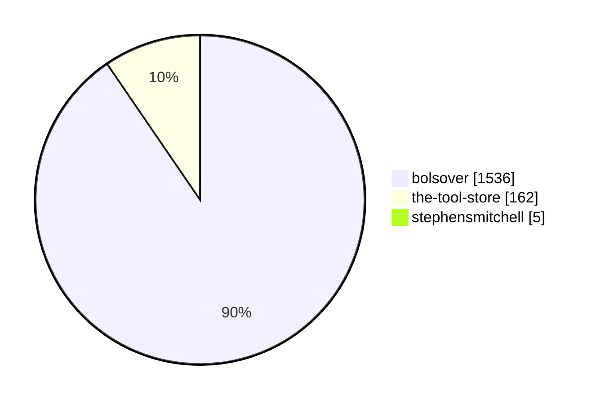

## Release Summary By Language

| Language | Repos | Releases | Assets | Total Downloads |
| --- | --- | --- | --- | --- |
| C# | 6 | 37 | 56 | 1623 |
| Python | 3 | 5 | 8 | 80 |

### Chart: By Release: Downloads by Language

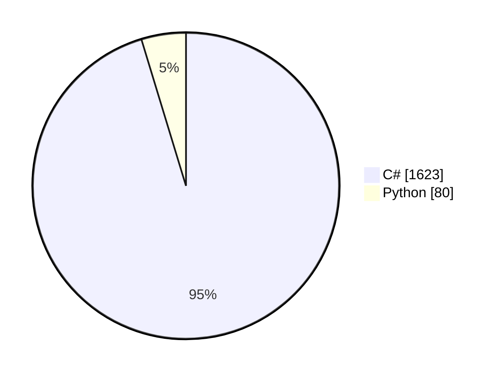

## Release Summary By Search Term

| Search Term | Repos | Releases | Assets | Total Downloads |
| --- | --- | --- | --- | --- |
| alibre | 9 | 42 | 64 | 1703 |
| "alibre design" | 1 | 1 | 3 | 62 |
| "alibre script" | 1 | 3 | 5 | 25 |
| alibrescript | 1 | 1 | 1 | 5 |
| "alibre api" | 0 | 0 | 0 | 0 |
| "alibrex api" | 0 | 0 | 0 | 0 |
| alibrex | 0 | 0 | 0 | 0 |

### Chart: By Release: Downloads by Search Term

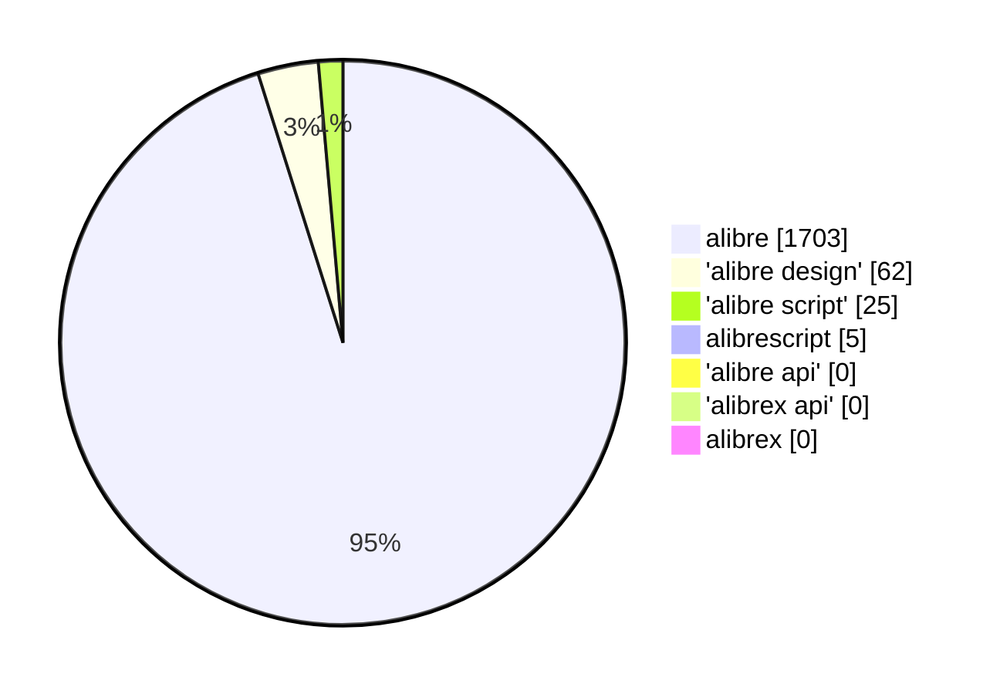

---

<h1>More breakdowns</h1>

# Search-Term Summary

## Executive Summary

- 66 unique repositories matched across 7 Alibre-related terms.
- 24 owners/orgs are represented.
- Aggregate social footprint is modest: 64 stars, 12 forks.
- Most results come from the base term `alibre`; phrase-level terms add classification depth.

## Core KPIs

| Metric | Value |
|---|---:|
| Repositories (union) | 66 |
| Owners/Orgs | 24 |
| Total Stars | 64 |
| Total Forks | 12 |
| Total Open Issues | 11 |
| Terms Queried | 7 |

## Term Coverage

| Term | Name/Description Matches |
|---|---:|
| alibre | 66 |
| "alibre design" | 15 |
| "alibre script" | 7 |
| alibrescript | 6 |
| alibrex | 4 |
| "alibrex api" | 1 |
| "alibre api" | 0 |

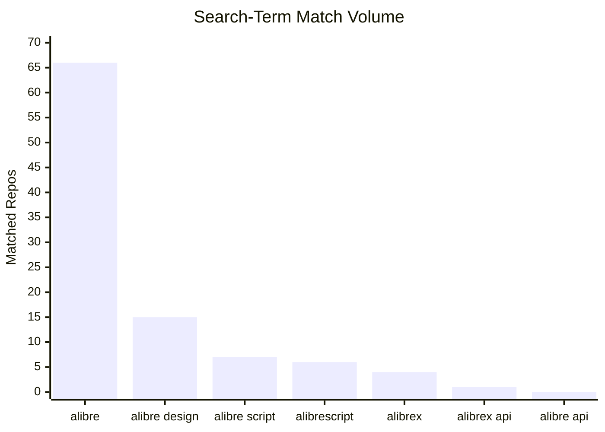

## Top Owners by Stars

| Owner | Repos | Stars |
|---|---:|---:|
| the-tool-store | 25 | 26 |
| bolsover | 7 | 17 |
| stephensmitchell | 13 | 14 |
| k4kfh | 1 | 2 |

## Language Mix (Top)

| Language | Repos |
|---|---:|
| Unspecified | 18 |
| Python | 16 |
| C# | 15 |
| Visual Basic .NET | 6 |
| C++ | 2 |

# Search-Term Detailed Report

Filter model: repository **name/description only** matching.

## 1) Search Term Performance

| Term | Quick Total (No Slice) | Matched by Name/Description | New Unique Repos | Newly Tagged Existing Repos |
|---|---:|---:|---:|---:|
| alibre | 67 | 66 | 66 | 0 |
| "alibre design" | 16 | 15 | 0 | 15 |
| "alibre script" | 14 | 7 | 0 | 7 |
| alibrescript | 6 | 6 | 0 | 6 |
| alibrex | 4 | 4 | 0 | 4 |
| "alibrex api" | 1 | 1 | 0 | 1 |
| "alibre api" | 0 | 0 | 0 | 0 |

## 2) Owner Concentration

| Rank | Owner | Repos | Stars | Forks |
|---:|---|---:|---:|---:|
| 1 | the-tool-store | 25 | 26 | 5 |
| 2 | bolsover | 7 | 17 | 4 |
| 3 | stephensmitchell | 13 | 14 | 1 |
| 4 | k4kfh | 1 | 2 | 1 |
| 5 | 100ideas | 1 | 1 | 0 |
| 6 | ajayre | 1 | 1 | 0 |
| 7 | Karl690 | 1 | 1 | 0 |
| 8 | KOCH-Engineering | 1 | 1 | 0 |

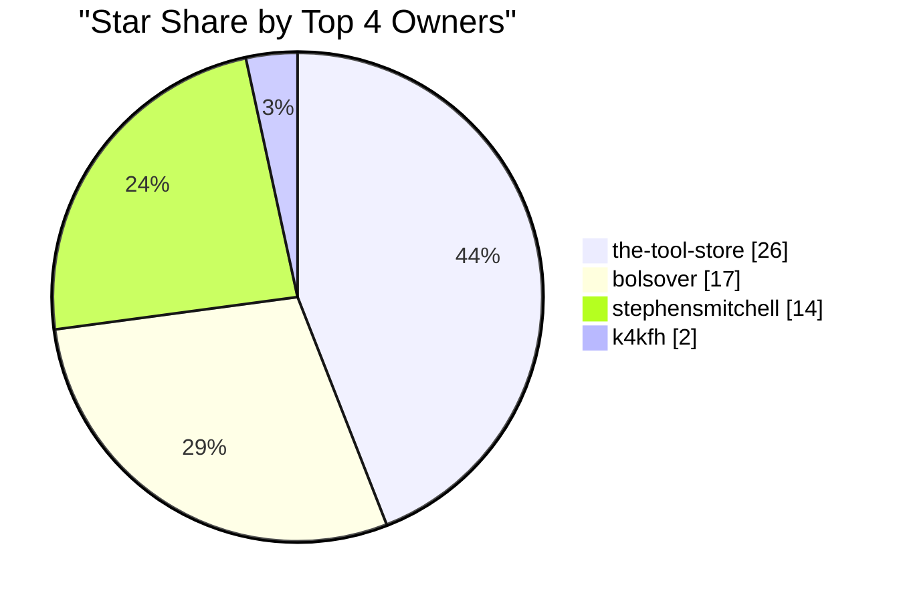

## 3) Top Repositories by Stars

| Rank | Repository | Stars | Forks | Language | Updated |
|---:|---|---:|---:|---|---|
| 1 | bolsover/UtilitiesForAlibre | 8 | 3 | C# | 2025-09-24T13:25:50Z |
| 2 | the-tool-store/alibre-stltostp-addon | 3 | 0 | C# | 2025-12-06T09:09:59Z |
| 3 | bolsover/AlibreBOM | 2 | 0 | C# | 2025-07-09T13:50:16Z |
| 4 | bolsover/AlibreExportOpen | 2 | 0 | C# | 2025-07-28T02:50:39Z |
| 5 | bolsover/AlibreShortcuts | 2 | 1 | C# | 2025-07-09T13:50:09Z |
| 6 | bolsover/DataBrowserForAlibre | 2 | 0 | C# | 2025-07-09T13:50:14Z |
| 7 | k4kfh/alibre-neutralizer | 2 | 1 | Python | 2025-11-10T06:09:09Z |
| 8 | stephensmitchell/AlibreScript | 2 | 0 | Python | 2026-01-25T07:51:07Z |
| 9 | the-tool-store/alibre-export-addon | 2 | 0 | Unspecified | 2025-11-10T06:11:00Z |
| 10 | 100ideas/ucam-alibre-cad | 1 | 0 | Unspecified | 2016-03-17T22:42:32Z |

## 4) Language Distribution

| Language | Repo Count |
|---|---:|
| Unspecified | 18 |
| Python | 16 |
| C# | 15 |
| Visual Basic .NET | 6 |
| C++ | 2 |
| HTML | 2 |
| JavaScript | 1 |
| Jupyter Notebook | 1 |
| Kotlin | 1 |
| OpenSCAD | 1 |
| PHP | 1 |
| Terra | 1 |

## 5) Detailed Totals

| Metric | Value |
|---|---:|
| Total Repositories | 66 |
| Total Owners | 24 |
| Total Stars | 64 |
| Total Forks | 12 |
| Total Open Issues | 11 |

# Release Analytics Summary

## Executive Summary

- 1,957 total release downloads across 16 repositories.
- 50 release rows were captured.
- Download concentration is high in `bolsover/UtilitiesForAlibre` (1,223 downloads).

## Core KPIs

| Metric | Value |
|---|---:|
| Total Downloads | 1,957 |
| Repositories with Releases | 16 |
| Release Rows | 50 |
| Top Repo Downloads | 1,223 |

## Top Repositories by Downloads

| Repository | Total Downloads | Releases |
|---|---:|---:|
| bolsover/UtilitiesForAlibre | 1,223 | 17 |
| bolsover/StlStpConverter | 171 | 4 |
| bolsover/AlibreShortcuts | 147 | 10 |
| bolsover/AlibreExportOpen | 113 | 2 |
| the-tool-store/alibre-sweep-tools-addon | 70 | 2 |
| the-tool-store/alibre-python-shell-addon | 62 | 1 |

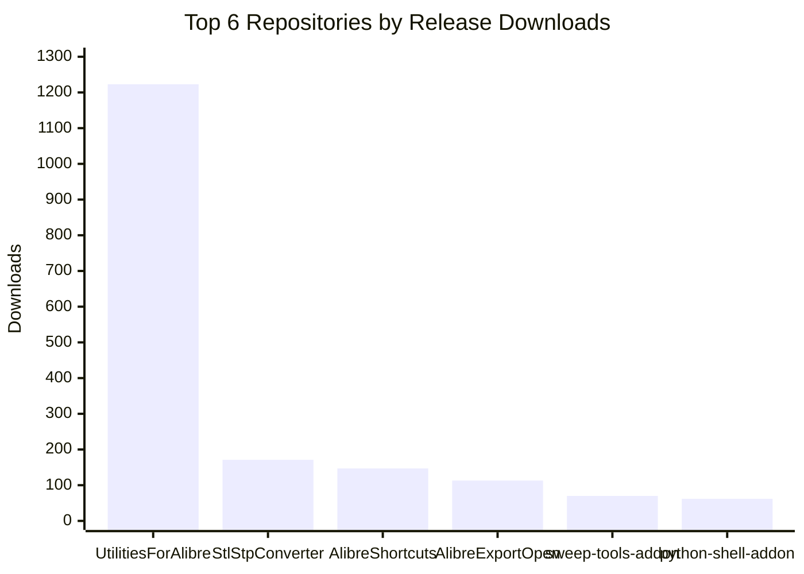

## Top Releases by Downloads

| Repository | Tag | Published | Downloads |
|---|---|---|---:|
| bolsover/UtilitiesForAlibre | V2.1.0.0 | 2024-03-18T21:24:33Z | 388 |
| bolsover/UtilitiesForAlibre | V3.0.0.0 | 2024-06-03T10:51:52Z | 214 |
| bolsover/UtilitiesForAlibre | V1.0.0.11 | 2022-06-09T18:23:29Z | 137 |
| bolsover/UtilitiesForAlibre | V3.1.0.0 | 2025-09-24T13:32:15Z | 89 |
| bolsover/AlibreExportOpen | V1.1 | 2022-11-08T15:01:00Z | 85 |

# Release Analytics Detailed Report

## 1) Portfolio Totals

| Metric | Value |
|---|---:|
| Total Downloads | 1,957 |
| Repositories with Release Data | 16 |
| Release Records | 50 |

## 2) Repository Download Ranking

| Rank | Repository | Total Downloads | Releases |
|---:|---|---:|---:|
| 1 | bolsover/UtilitiesForAlibre | 1,223 | 17 |
| 2 | bolsover/StlStpConverter | 171 | 4 |
| 3 | bolsover/AlibreShortcuts | 147 | 10 |
| 4 | bolsover/AlibreExportOpen | 113 | 2 |
| 5 | the-tool-store/alibre-sweep-tools-addon | 70 | 2 |
| 6 | the-tool-store/alibre-python-shell-addon | 62 | 1 |
| 7 | bolsover/AlibreImportStlAsStep | 53 | 4 |
| 8 | stephensmitchell/alibre-development | 43 | 1 |
| 9 | bolsover/CycloidalGear | 34 | 1 |
| 10 | the-tool-store/alibre-shapes-addon | 25 | 3 |
| 11 | stephensmitchell/AlibreScript-vscode | 5 | 1 |
| 12 | stephensmitchell/sgcore-docs | 5 | 1 |

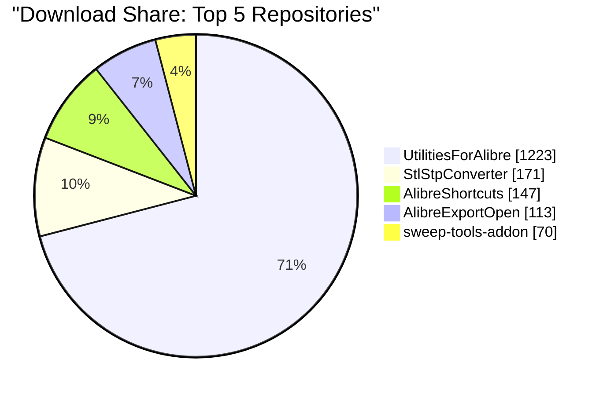

## 3) Top Releases by Download Count

| Rank | Repository | Tag | PublishedAt | Downloads |
|---:|---|---|---|---:|
| 1 | bolsover/UtilitiesForAlibre | V2.1.0.0 | 2024-03-18T21:24:33Z | 388 |
| 2 | bolsover/UtilitiesForAlibre | V3.0.0.0 | 2024-06-03T10:51:52Z | 214 |
| 3 | bolsover/UtilitiesForAlibre | V1.0.0.11 | 2022-06-09T18:23:29Z | 137 |
| 4 | bolsover/UtilitiesForAlibre | V3.1.0.0 | 2025-09-24T13:32:15Z | 89 |
| 5 | bolsover/AlibreExportOpen | V1.1 | 2022-11-08T15:01:00Z | 85 |
| 6 | bolsover/UtilitiesForAlibre | V1.3.0.0 | 2022-11-04T16:43:51Z | 84 |
| 7 | bolsover/AlibreShortcuts | V3.1 | 2023-11-23T14:24:56Z | 63 |
| 8 | the-tool-store/alibre-python-shell-addon | v2024.03.19 | 2024-03-19T21:23:47Z | 62 |
| 9 | bolsover/StlStpConverter | V2.1 | 2025-11-16T15:06:32Z | 60 |
| 10 | bolsover/StlStpConverter | V2.2 | 2026-01-06T16:05:40Z | 45 |
| 11 | bolsover/UtilitiesForAlibre | V1.1.0.1 | 2022-09-01T16:14:54Z | 45 |
| 12 | stephensmitchell/alibre-development | test1 | 2025-12-26T13:03:58Z | 43 |
| 13 | the-tool-store/alibre-sweep-tools-addon | poc-r1 | 2025-08-26T05:06:21Z | 42 |
| 14 | bolsover/StlStpConverter | V2.3 | 2026-01-11T11:37:22Z | 40 |
| 15 | bolsover/UtilitiesForAlibre | V1.0.0.10 | 2022-06-08T11:46:46Z | 38 |

## 4) Concentration Notes

- The top repository contributes 62.5% of total downloads (1,223 / 1,957).
- The top 4 repositories contribute 84.0% of total downloads (1,654 / 1,957).
- Distribution suggests strong concentration in a small set of mature utility repos.
